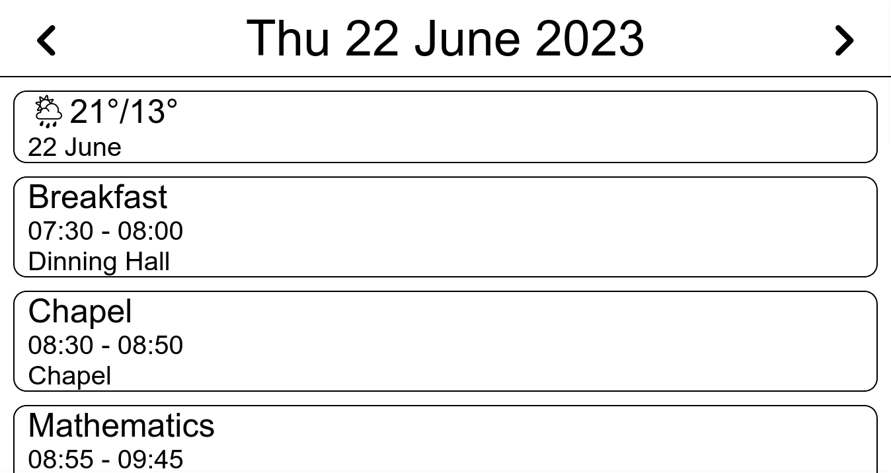

# Calendar for E-Ink
**A simple PHP calendar optimised for e-ink displays**

Uses [IcalParser](https://github.com/OzzyCzech/icalparser) library by OzzyCzech

## ☁️ [Weather.php](weather.php)
* ☔ Shows a 7-day forecast, heavily inspired by [Weather in Your Calendar by @vejnoe](https://github.com/vejnoe/weather-in-your-calendar/tree/master)
* 💻 Uses [Open-Meteo API](https://open-meteo.com/) for weather data & geocoding, no API key required!
* __🗺 Use query string "?city=" to specify city__

## ⚙ [Config.php](config.php)
* 🌍 __`$remote_urls`__: To add URLs, edit config.php and add your URLs array.
* 🔗 __`$offline`__: Enables offline mode
    * `False`: Loads directly from URLs every time
    * `True`: Uses cached ics files from `./calendars/*`. Learn more about updating files [here](#update)

## ⟳ [Update.php](update.php)
Updates locally cached version of calendars. Load page with query string `?city=` to specify location for updating weather file. Use cron to automatically run script.

* Run in terminal: `crontab -e`
* Append: `0 */2 * * * php -f $HOME/www/html/calendar/update.php` (or whatever is your path to file)

## Contribution
As a full time student I don't really maintain this project much, but please feel free to submit pull requests